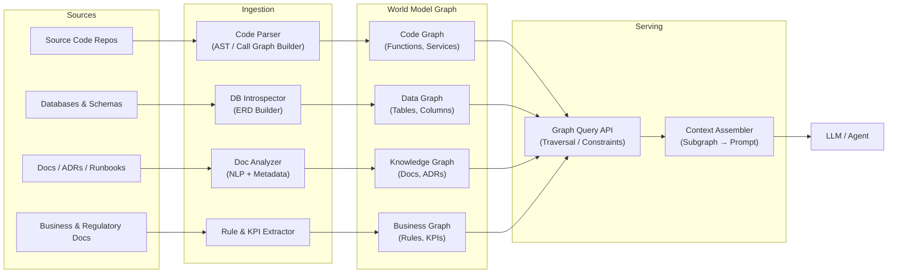
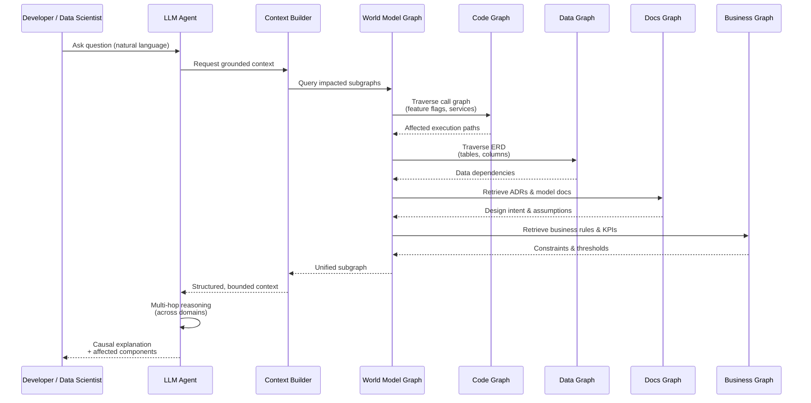

# Use Case: Production Incident Resolution & Feature Extension in a Regulated FinTech Platform

## Persona

Role: Senior Data Scientist / Platform Engineer

Context: Large FinTech company operating a real-time fraud detection and transaction processing system

Constraints:

* Microservice architecture (~120 services)
* Polyglot codebase (Rust, Python, Java)
* Multiple databases (Postgres, DynamoDB, ClickHouse)
* Regulatory requirements (SOX, PCI-DSS)
* Extensive but fragmented documentation

## The Problem Without a World Model

A fraud spike occurs after a new “instant payout” feature is deployed.

Symptoms:

* False positives increased by 18%
* Transaction latency increased by 40ms P95
* Customer complaints escalating

The developer/data scientist must answer:

1. Which code paths changed the model’s inputs?
2. Which database entities are involved and how were they mutated?
3. Which business rules or regulatory constraints apply?
4. Which downstream services are affected?

Today, this requires:

* Grepping multiple repos
* Reading stale docs
* Manually reconstructing call graphs
* Tribal knowledge from Slack threads
* Risky assumptions

Bottom line: 
* Everything here is possible, but requires a lot of manual effort.
* The LLM is not able to answer these questions because it does not have a complete understanding of the system.

## The World Model (What Exists)

A Graph-based World Model exposed to the LLM, containing:

### Code Call Graph

#### Nodes

* Functions
* Methods
* Services
* APIs

#### Edges

* Calls
* Async events
* Data flow (input → output)
* Feature flags / config gates

Example:

```
TransactionService::process()
  → RiskEngine::score()
    → FeatureFlag::instant_payout_v2
    → FraudModel::predict()
```

### Entity Relationship Diagram (ERD)

#### Nodes

* Tables
* Columns
* Indexes
* Materialized views

#### Edges

* Foreign keys
* Soft joins (application-level joins)
* Read/write ownership by service

Example:

```
transactions
  ├─ transaction_id (PK)
  ├─ user_id (FK → users.id)
  ├─ risk_score
  └─ payout_method

fraud_signals
  └─ transaction_id (FK → transactions.transaction_id)
```

Notes: One database will have customer id as an integer, another database will have it as string with preceding zeros to fit char(15). All this knowledge has to exist and be persisted anywhere otherwise the investigation will take that much longer.

### Documentation Graph

#### Nodes

* ADRs
* Design docs
* Runbooks
* Model cards
* API docs

#### Edges

* References
* Supersedes
* Applies-to (code/entity)

Example:

```
ADR-042 "Instant Payout v2"
  → applies_to: FraudModel::predict
  → references: ModelCard-Fraud-v7
```

### Business & Regulatory Context

#### Nodes

* Business rules
* KPIs
* Regulatory requirements
* Customer promises (SLA, UX guarantees)

#### Edges

* Governs
* Constrains
* Justifies
* Prohibits

Example:

```
PCI-DSS-3.2
  → constrains: transactions.card_number
  → prohibits: logging raw PAN
```

## The LLM-Driven Workflow

### Step 1: Natural Language Question

The developer asks:
> “Why did false positives increase after instant payout v2, and which parts of the system are responsible?”

### Step 2: LLM Traverses the World Model

The LLM:

1. Traverses deployment graph → identifies changed services
2. Follows call graph → identifies new scoring path
3. Traverses ERD → finds new joins introduced
4. Pulls model documentation → sees feature normalization change
5. Applies business rules → checks fraud tolerance thresholds

### Step 3: LLM Produces a Grounded Answer

Example LLM Output
> The increase in false positives is caused by `FraudModel::predict()` receiving an unnormalized `payout_method` feature
> when `instant_payout_v2` is enabled.
>
> This change was introduced in `RiskEngine::score()` and applies only to transactions routed through
> `TransactionService::process()` for eligible users.
>
> The feature relies on the `transactions.payout_method` column, which was added in migration `2025_01_12_1530`, but the
> model card `Fraud-v7` specifies normalization rules that are not applied in the v2 path.
>
> This violates the business rule defined in `BR-017` (“False positive rate < 2.5% for instant payouts”) and indirectly
> increases latency due to retries triggered by declined payouts.

### Why This Requires a World Model (Not Just RAG)

| Problem	                         | Why RAG Alone Fails                                | 
|----------------------------------|----------------------------------------------------|
| Understanding execution flow     | Requires call graph traversal, not text similarity |
| Linking code to data	           | Requires explicit data ownership and ERD edges     |
| Applying business rules	         | Requires semantic constraints, not raw docs        |
| Multi-hop reasoning	             | Requires graph traversal across domains            |
| Understanding When Changes Occur | RAG doesn't index from ServiceNow or JIRA          |

A world model enables:
* Deterministic context assembly
* Multi-modal reasoning (code + data + business)
* Fewer hallucinations
* Auditable answers

Secondary Use Cases Enabled
🚀 Feature Design
> “If we add a new fraud signal, which services, tables, and KPIs will be affected?”

🔐 Compliance Audits
> “Show all code paths that touch regulated data and the business justification.”

🧠 Model Debugging
> “Which upstream features feed this model and where are they sourced from?”

🛠 Refactoring Safety
> “What breaks if I change this function signature?”

## World Model Architecture (Mermaid – System / Data Architecture)

This diagram shows how code, data, documentation, and business context are ingested, unified into a world model, and exposed to an LLM. 


Key Architectural Insights

* No single index: multiple domain graphs are linked by shared nodes and edges.
* Graph API is first-class: LLM never queries raw sources directly.
* Context builder is deterministic: subgraph selection is explainable and auditable.

## Data & Reasoning Sequence Diagram (Mermaid – Runtime Flow)

This shows what happens when a developer asks a question like:
> “Why did false positives increase after instant payout v2?” 



## Why This Matters (Design Implications)
### Deterministic Context

The LLM cannot hallucinate dependencies because it only sees:
* Traversed code paths
* Explicit data relationships
* Linked documentation
* Applicable business constraints

### Multi-Hop Without Token Explosion

* Graph traversal replaces brute-force retrieval
* Only relevant subgraphs enter the prompt

### Auditable Answers

Every conclusion can be traced back to:
* A code edge
* A schema relationship
* A documented rule

## Summary

This use case demonstrates why advanced developers and data scientists need a unified world model:

* Code call graphs explain how the system executes
* ERDs explain what data is involved
* Documentation explains why decisions were made
* Business materials explain what must not be violated

When all of this is available to an LLM as a connected graph, the LLM becomes:

* A senior engineer
* A system historian
* A compliance-aware analyst

—not just a text autocomplete engine.

