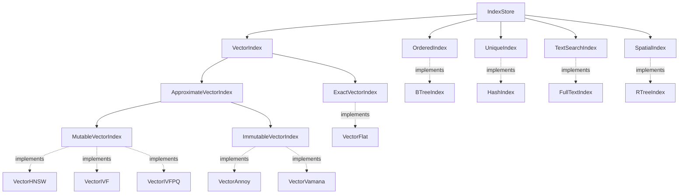

# Index Traits Summary

## Quick Reference

This document provides a quick reference for the Nanograph index trait hierarchy.

## Index Type to Trait Mapping

| Index Type | Primary Trait | Secondary Traits | Status |
|------------|---------------|------------------|--------|
| **Secondary (B-Tree)** | `OrderedIndex` | `IndexStore` | 🚧 In Progress |
| **Unique (Hash)** | `UniqueIndex` | `IndexStore` | 🚧 In Progress |
| **FullText (Inverted)** | `TextSearchIndex` | `IndexStore` | 📋 Planned |
| **Spatial (R-Tree)** | `SpatialIndex` | `IndexStore` | 📋 Planned |
| **VectorFlat** | `ExactVectorIndex` | `VectorIndex`, `IndexStore` | 📋 Planned |
| **VectorHNSW** | `MutableVectorIndex` | `ApproximateVectorIndex`, `VectorIndex`, `IndexStore` | 📋 Planned |
| **VectorIVF** | `MutableVectorIndex` | `ApproximateVectorIndex`, `VectorIndex`, `IndexStore` | 📋 Planned |
| **VectorIVFPQ** | `MutableVectorIndex` | `ApproximateVectorIndex`, `VectorIndex`, `IndexStore` | 📋 Planned |
| **VectorAnnoy** | `ImmutableVectorIndex` | `ApproximateVectorIndex`, `VectorIndex`, `IndexStore` | 📋 Planned |
| **VectorVamana** | `ImmutableVectorIndex` | `ApproximateVectorIndex`, `VectorIndex`, `IndexStore` | 📋 Planned |

## Trait Hierarchy Diagram



## Trait Characteristics

### OrderedIndex
- **Purpose**: Range queries, sorted scans
- **Key Methods**: `range_scan()`, `min_key()`, `max_key()`, `prefix_scan()`
- **Use Cases**: Age ranges, date ranges, alphabetical sorting
- **Performance**: O(log n) for point queries, O(log n + k) for range queries

### UniqueIndex
- **Purpose**: Uniqueness constraints, fast lookups
- **Key Methods**: `lookup_unique()`, `validate_unique()`
- **Use Cases**: Email addresses, usernames, IDs
- **Performance**: O(1) for point queries

### TextSearchIndex
- **Purpose**: Full-text search with relevance
- **Key Methods**: `search()`, `phrase_search()`, `boolean_search()`
- **Use Cases**: Document search, keyword matching
- **Performance**: O(k) where k is number of matching documents

### SpatialIndex
- **Purpose**: Geometric and geographic queries
- **Key Methods**: `query_bbox()`, `query_knn()`, `query_radius()`, `query_polygon()`
- **Use Cases**: Location search, nearest neighbor, geofencing
- **Performance**: O(log n + k) for most queries

### VectorIndex (Base)
- **Purpose**: Common vector operations
- **Key Methods**: `search_knn()`, `search_range()`
- **Use Cases**: Similarity search, embeddings
- **Performance**: Varies by implementation

### ExactVectorIndex
- **Purpose**: Exact nearest neighbor search
- **Key Methods**: `exact_search_knn()`
- **Use Cases**: Small datasets, high accuracy requirements
- **Performance**: O(n) brute-force search

### ApproximateVectorIndex
- **Purpose**: Fast approximate search
- **Key Methods**: `approximate_search_knn()`, `estimate_recall()`
- **Use Cases**: Large datasets, real-time search
- **Performance**: Sub-linear (O(log n) to O(√n))

### MutableVectorIndex
- **Purpose**: Dynamic vector updates
- **Key Methods**: `add_vector()`, `remove_vector()`, `update_vector()`
- **Use Cases**: Streaming data, real-time updates
- **Performance**: Incremental updates supported

### ImmutableVectorIndex
- **Purpose**: Static, read-optimized indexes
- **Key Methods**: `build_from_vectors()`, `is_built()`, `rebuild()`
- **Use Cases**: Static datasets, batch processing
- **Performance**: Optimized for queries, expensive updates

## Implementation Checklist

### Phase 1: Core Traits ✓
- [x] Design trait hierarchy
- [x] Document design decisions
- [x] Create implementation plan
- [ ] Create traits module structure

### Phase 2: Ordered Indexes
- [ ] Implement `OrderedIndex` trait
- [ ] Implement `UniqueIndex` trait
- [ ] Update `BTreeIndex` implementation
- [ ] Update `HashIndex` implementation
- [ ] Add tests for ordered indexes

### Phase 3: Text Search
- [ ] Implement `TextSearchIndex` trait
- [ ] Add tokenization support
- [ ] Add scoring algorithms (TF-IDF, BM25)
- [ ] Update `FullTextIndex` implementation
- [ ] Add tests for text search

### Phase 4: Spatial
- [ ] Implement `SpatialIndex` trait
- [ ] Add geometric primitives
- [ ] Add distance metrics
- [ ] Update `RTreeIndex` implementation
- [ ] Add tests for spatial queries

### Phase 5: Vector Base
- [ ] Implement `VectorIndex` trait
- [ ] Implement `ExactVectorIndex` trait
- [ ] Create `VectorFlat` implementation
- [ ] Add distance metrics
- [ ] Add tests for exact search

### Phase 6: Vector ANN
- [ ] Implement `ApproximateVectorIndex` trait
- [ ] Implement `MutableVectorIndex` trait
- [ ] Implement `ImmutableVectorIndex` trait
- [ ] Create stub implementations for all vector types
- [ ] Add tests for approximate search

### Phase 7: Documentation & Examples
- [ ] API documentation for all traits
- [ ] Usage examples for each index type
- [ ] Performance benchmarks
- [ ] Migration guide for existing code

## Key Design Decisions

### 1. Trait Composition Over Inheritance
**Decision**: Use trait bounds and composition rather than deep inheritance

**Rationale**:
- More flexible for future extensions
- Allows mixing traits as needed
- Better compile-time guarantees
- Clearer API contracts

### 2. Async-First Design
**Decision**: All index operations are async

**Rationale**:
- Supports I/O operations (disk, network)
- Enables concurrent operations
- Future-proof for distributed systems
- Aligns with Tokio ecosystem

### 3. Separate Mutable/Immutable Traits
**Decision**: Distinguish mutable vs immutable vector indexes

**Rationale**:
- Some algorithms require full rebuild (Annoy, Vamana)
- Prevents incorrect usage patterns
- Enables optimization for static datasets
- Clear API contract and expectations

### 4. Approximate vs Exact Search
**Decision**: Separate traits for exact and approximate search

**Rationale**:
- Different performance guarantees
- Different accuracy expectations
- Allows algorithm-specific optimizations
- Clear documentation of behavior

### 5. Generic Entry Types
**Decision**: Use specialized entry types (ScoredEntry, DistancedEntry, SimilarityEntry)

**Rationale**:
- Type-safe API
- Clear semantics for each index type
- Prevents mixing incompatible operations
- Better IDE support and documentation

## Usage Patterns

### Pattern 1: Generic Index Operations
```rust
async fn query_any_index<I: IndexStore>(index: &I, query: IndexQuery) -> IndexResult<Vec<IndexEntry>> {
    index.query(query).await
}
```

### Pattern 2: Ordered Index Operations
```rust
async fn scan_range<I: OrderedIndex>(index: &I, start: &[u8], end: &[u8]) -> IndexResult<Vec<IndexEntry>> {
    index.range_scan(
        Bound::Included(start.to_vec()),
        Bound::Excluded(end.to_vec()),
        None,
        false,
    ).await
}
```

### Pattern 3: Text Search
```rust
async fn search_documents<I: TextSearchIndex>(index: &I, query: &str) -> IndexResult<Vec<ScoredEntry>> {
    index.search(query, Some(10)).await
}
```

### Pattern 4: Spatial Queries
```rust
async fn find_nearby<I: SpatialIndex>(index: &I, location: Point, count: usize) -> IndexResult<Vec<DistancedEntry>> {
    index.query_knn(location, count).await
}
```

### Pattern 5: Vector Similarity
```rust
async fn find_similar<I: VectorIndex>(index: &I, embedding: &[f32], k: usize) -> IndexResult<Vec<SimilarityEntry>> {
    index.search_knn(embedding, k).await
}
```

## Performance Characteristics

| Index Type | Build Time | Query Time | Memory | Update Cost | Best For |
|------------|-----------|------------|--------|-------------|----------|
| **BTree** | O(n log n) | O(log n + k) | O(n) | O(log n) | Range queries |
| **Hash** | O(n) | O(1) | O(n) | O(1) | Point lookups |
| **FullText** | O(n·m) | O(k) | O(n·m) | O(m) | Text search |
| **Spatial** | O(n log n) | O(log n + k) | O(n) | O(log n) | Geo queries |
| **VectorFlat** | O(n) | O(n·d) | O(n·d) | O(1) | Small datasets |
| **VectorHNSW** | O(n log n·d) | O(log n·d) | O(n·d·M) | O(log n·d) | High recall |
| **VectorIVF** | O(n·d) | O(√n·d) | O(n·d) | O(√n·d) | Large datasets |
| **VectorAnnoy** | O(n log n·d) | O(log n·d) | O(n·d) | Rebuild | Static data |

*Where: n = number of entries, k = result size, d = dimensions, m = terms per document, M = HNSW parameter*

## Migration Guide

### From Current Code
```rust
// Old: Direct implementation usage
let index = BTreeIndex::new(metadata)?;
let results = index.query(query).await?;

// New: Trait-based usage
let index: Box<dyn OrderedIndex> = Box::new(BTreeIndex::new(metadata)?);
let results = index.range_scan(start, end, None, false).await?;
```

### Adding New Index Types
1. Implement `IndexStore` trait (required)
2. Implement specialized trait(s) based on index characteristics
3. Add tests for all trait methods
4. Add benchmarks
5. Update documentation

## Related Documents

- [`INDEX_TRAIT_DESIGN.md`](INDEX_TRAIT_DESIGN.md) - Detailed design document
- [`TRAIT_IMPLEMENTATION_PLAN.md`](TRAIT_IMPLEMENTATION_PLAN.md) - Implementation details
- [`README.md`](README.md) - General index documentation

## Status Legend

- ✅ **Completed**: Fully implemented and tested
- 🚧 **In Progress**: Currently being implemented
- 📋 **Planned**: Designed but not yet implemented
- ⏳ **Future**: Planned for future releases

---

**Document Version**: 1.0  
**Last Updated**: 2026-01-26  
**Next Review**: After Phase 2 completion